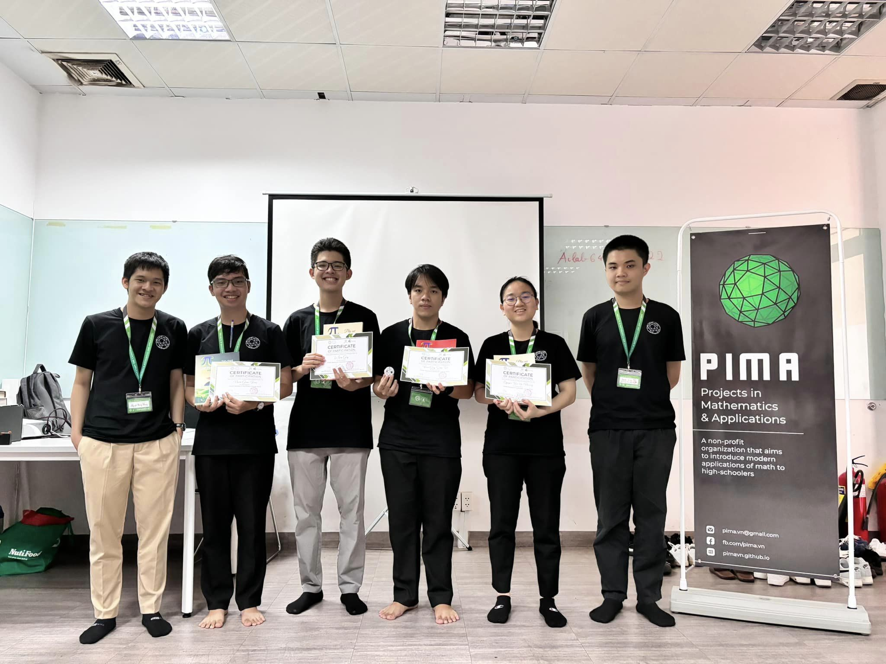

# Interior Point Method - PiMA 2024 Summer Camp Report

## Overview

This repository contains the final report on the **Interior Point Method** developed during the PiMA 2024 Research Summer Camp. Our report focuses on exploring and applying the interior point method, particularly the primal-dual approach, for solving linear programming problems.
### About PiMA 
- PiMA is a non-profit project founded by Mathematics enthusiasts from some of the major universities in the world.
- We strive for assisting and mentoring students in Vietnam who are curious to learn about Mathematics and its applications.
  

width="200px"
height="150px"

### Key Topics Covered:
- Theoretical foundation of the Interior Point Method
- Algorithm design, including the **Barrier Problem** and **Central Path**
- Comparison with other optimization algorithms like the Simplex Method
- Practical applications, including a case study on the **Transportation Problem**

### Contributors
- Phạm Quốc Bình
- Bảo Quý Định Tân
- Nguyễn Trần Hà Phương
- Lê Minh Quý

### Contents
- `[Group 6] Interior Point Method - Final Report - English version.pdf`: The full report (in English) in PDF format
- `[Group 6] Interior Point Method - Final Report - Vietnamese version.pdf`: The full report (in Vietnamese) in PDF format 
- `PiMA_2024_Interior_Point_Method_Notebook.ipynb`: Jupyter Notebook containing our code implementation for solving optimization problems using the Interior Point Method
- `[Group 6] Interior Point Method - Slides - Vietnamese version.pdf`: The slide in PDF format we use in our final day representation

### How to Use
1. Clone the repository:
   ```bash
   git clone https://github.com/your-repo-name/interior-point-method-report.git
